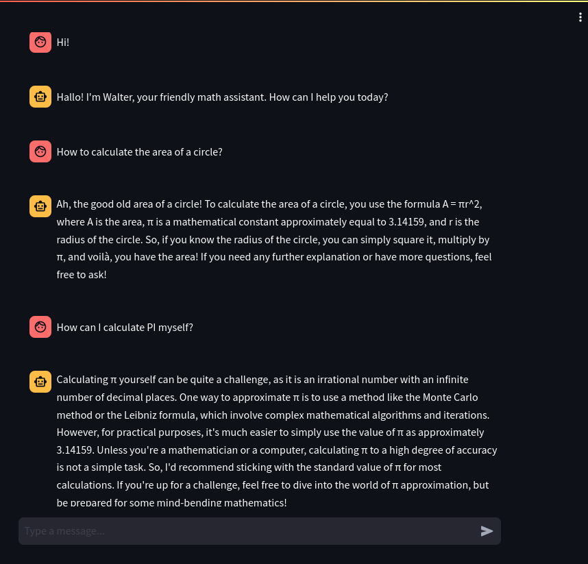
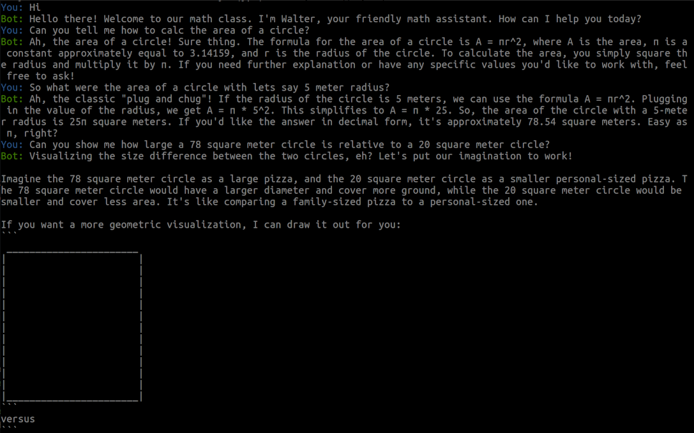

# 🤖 BuildYourBot 🤖

This repository contains several very basic examples about how to build a simple chatbot
using the OpenAI API.

The sample code tracks your chat history, summarizes it if needed
(as well using the OpenAI chat API) restores the history from previous sessions, and then
continues the conversation, tracks the costs and token usage etc.

In addition it provides two sample applications which can be used to test the API and
behaves like a math teacher. Feel free to write your own prompts and experiment with
it.

## Streamlit Chatbot Demo



To run the streamlit demo (after you followed the setup instructions below):
```bash
poetry run streamlit run oaisamples/streamlit_sample/app.py --server.headless true --runner.magicEnabled false
```

Afterwards click the local network link to open your browser.

## Console Chatbot Demo



To run the console demo (after you followed the setup instructions below):
```bash
poetry run python oaisamples/console_bot/console_bot.py
```


---

## Installation

* Install Python 3.10 or above
* Install poetry, if you do not have it already

```bash
pip install poetry
```

* Go to this project's root directory
* Install the dependencies defined in **pyproject.toml**:
```bash
poetry install
```

---

## Configuration

* Create an OpenAI account and get an API key
* Create a `.env` file in the root of the project and add the following:

### OpenAI

If you are using OpenAI you need at least to setup the OPENAI_KEY and the OPENAI_BASE_MODEL.

```
OPENAI_KEY=YOUR_KEY_HERE
OPENAI_API_VERSION=2023-05-15
OPENAI_BASE_MODEL=gpt-35-turbo
# GPT 3.5-Turbo as of 2023-12. The pricing if you want to track it
OPENAI_COSTS_PER_1K_IN=0.001
OPENAI_COSTS_PER_1K_OUT=0.002
```

### Azure

When using Azure you need to setup the OPENAI_KEY, OPENAI_AZURE_ENDPOINT and the OPENAI_BASE_MODEL.

```
OPENAI_KEY=YOUR_KEY_HERE
OPENAI_AZURE_ENDPOINT=https://YOUR_ENDPOINT.openai.azure.com/
OPENAI_API_VERSION=2023-05-15
OPENAI_BASE_MODEL=YOUR_DEPLOYMENT_NAME_NOT_THE_MODEL
# GPT 3.5-Turbo as of 2023-12. The pricing if you want to track it
OPENAI_COSTS_PER_1K_IN=0.001
OPENAI_COSTS_PER_1K_OUT=0.002
```

Alternatively to using an `.env` file you can also set the environment variables directly.

## License

The code is licensed under the MIT license. See [LICENSE](LICENSE) for more information.